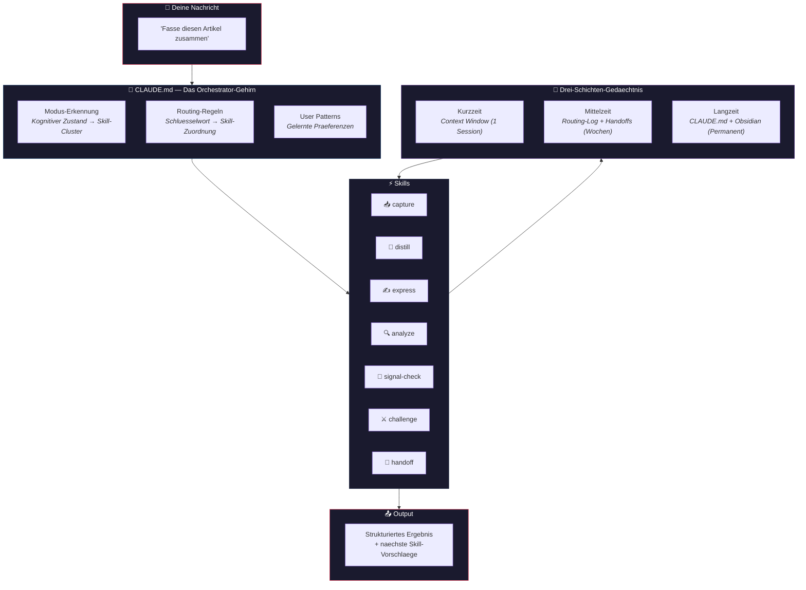
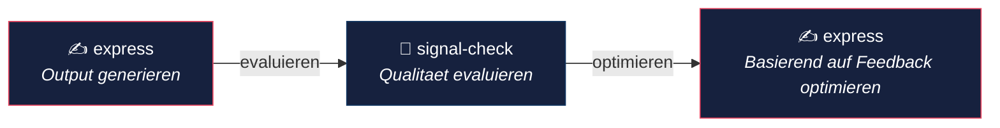
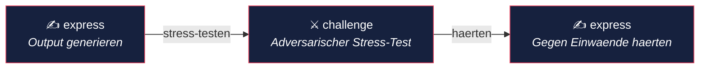

<p align="center">
  <h1 align="center">Claude Orchestrator Starter Kit</h1>
  <p align="center">
    Mache aus Claude Code einen persoenlichen KI-Assistenten — mit persistentem Gedaechtnis, eigenen Skills und Obsidian als Wissensbasis.
  </p>
  <p align="center">
    <a href="LICENSE"></a>
    <a href="https://docs.anthropic.com/en/docs/claude-code"></a>
    
    <a href="https://obsidian.md">
    </a>
  </p>
  <p align="center">
    <a href="https://janrummel.github.io/claude-orchestrator-starter/">🌐 Website</a> ·
    <strong>Deutsch</strong> | <a href="README.md">English</a>
  </p>
</p>

---

> **Dieses Starter Kit ist aus einem realen persoenlichen Orchestrator extrahiert**, der taeglich fuer Engineering, Recherche und Wissensmanagement im Einsatz ist. Das vollstaendige System umfasst 20+ eigene Skills, 6 verbundene Obsidian-Vaults, eine SQLite-Wissensdatenbank und automatisierte Session-Handoffs. Was du hier siehst, sind die **grundlegenden Bausteine** — die Architektur und Muster, die alles andere erst ermöglichen.

---

## Das Problem

Jede Claude Code Session startet bei Null. Kein Gedaechtnis an gestrige Entscheidungen. Keine Ahnung, woran du arbeitest. Keine wiederverwendbaren Workflows. Du erklaerst immer wieder das Gleiche.

**Dieses Kit aendert das.**

## Was du bekommst

```
Du                                      Claude (mit Orchestrator)
─────────────────────────────           ──────────────────────────────────
"Fasse diesen Artikel zusammen"         → Ruft distill Skill auf
                                          Prueft vorhandenes Wissen zuerst
                                          Liefert strukturierten Output
                                          Schlaegt vor: /signal-check oder /capture

"Ist diese Analyse solide?"             → Ruft signal-check Skill auf
                                          Evaluiert ueber 4 Achsen
                                          Markiert Luecken und Framing
                                          Schlaegt vor: /express zum Verbessern

"Was kann an dem Plan schiefgehen?"     → Erkennt Reflection-Modus
                                          Ruft challenge Skill auf
                                          Stress-Test aus 3 Perspektiven
                                          Schlaegt vor: /express zum Haerten

"Zustand sichern fuer naechstes Mal"   → Ruft handoff Skill auf
                                          Erfasst Entscheidungen + Kontext
                                          Schreibt Projekt-State-Datei
                                          Naechste Session knuepft nahtlos an
```

## Wie es funktioniert



## Die Architektur

### Drei-Schichten-Gedaechtnis

| | Schicht | Was | Wo | Lebensdauer |
|---|---------|-----|-----|-------------|
| **1** | Kurzzeit | Aktuelle Konversation | Context Window | 1 Session |
| **2** | Mittelzeit | Vergangene Sessions, Routing-Log | `orchestrator/routing-log.jsonl`, Projekt-States | Wochen bis Monate |
| **3** | Langzeit | Regeln, Praeferenzen, Wissen | `CLAUDE.md`, `memory/`, Obsidian | Permanent |

```
┌─────────────────────────────────────────────────────┐
│  ░░░░░░░░ KURZZEIT  (Context Window) ░░░░░░░░░░░░  │
│  Aktuelle Konversation, temporaere Ergebnisse        │
│  ⏱ Lebensdauer: 1 Session                           │
├─────────────────────────────────────────────────────┤
│  ▒▒▒▒▒▒▒ MITTELZEIT  (State + Episodic) ▒▒▒▒▒▒▒▒  │
│  Vergangene Sessions, Routing-Entscheidungen         │
│  ⏱ Lebensdauer: Wochen bis Monate                   │
├─────────────────────────────────────────────────────┤
│  ████████ LANGZEIT  (CLAUDE.md + Wissen) ██████████  │
│  Routing-Regeln, Praeferenzen, Glossar, Kontext      │
│  ⏱ Lebensdauer: Permanent                           │
└─────────────────────────────────────────────────────┘
```

### Sieben Kern-Skills

Jeder Skill ist eine `SKILL.md`-Datei — **Anweisungen, kein Code**. Sie sagen Claude, wie es sich verhalten, welche Tools es nutzen und welchen Output es produzieren soll.

| | Skill | Zweck | Du sagst... |
|---|-------|-------|------------|
| 📥 | **capture** | Schnelle Notizen in Obsidian | "Notiere das", "Idee festhalten" |
| 🔬 | **distill** | Zusammenfassen und verdichten | "Zusammenfassen", "Kernaussagen" |
| ✍️ | **express** | Ausgefeilten Output schreiben | "Schreibe", "Formuliere" |
| 🔍 | **analyze** | Tiefenanalyse mit strukturiertem Denken | "Analysiere", "Untersuche" |
| 🎯 | **signal-check** | Qualitaetspruefung / Faktencheck | "Ist das solide?", "Substanz-Check" |
| ⚔️ | **challenge** | Adversarischer Stress-Test | "Was kann schiefgehen?", "Stress-Test" |
| 💾 | **handoff** | Session-Zustand fuer naechstes Mal sichern | "Zustand sichern", "Handoff" |

### Drei zentrale Schleifen

Diese 7 Skills bilden drei kraftvolle Feedback-Schleifen:

**Evaluator-Optimizer-Schleife** — Schreiben, evaluieren, verbessern:



**Evaluator-Challenger-Schleife** — Schreiben, Stress-Test, haerten:



**Wissenszyklus** — Erfassen, verarbeiten, ausgeben, pruefen:


### Routing

Die `CLAUDE.md`-Datei enthaelt Routing-Regeln, die Schluesselwoerter auf Skills abbilden. Wenn du etwas sagst, prueft Claude auf passende Muster und ruft automatisch den richtigen Skill auf.

```
Du: "Fasse diesen Artikel zusammen"
     │
     ▼
CLAUDE.md Routing-Tabelle
     │ erkennt "zusammenfassen" → distill
     ▼
Ruft distill Skill auf
     │
     ▼
Strukturierte Zusammenfassung + schlaegt vor: /signal-check · /express · /capture
```

### Gedaechtnis

Das `memory/`-Verzeichnis bietet Langzeitspeicherung:

```
memory/
├── glossary.md          — Fachbegriffe und Jargon
├── context/
│   └── company.md       — Arbeitskontext (Rolle, Unternehmen, Tools)
├── people/              — Wichtige Kontakte und Stakeholder
├── projects/            — Aktive Projektdokumentation
├── decisions/           — Entscheidungslog mit Begruendung
└── workflows/           — Bewaehrte Workflows und Best Practices
```

## Schnellstart

> **Dauer:** ~5 Minuten | **Voraussetzungen:** [Claude Code](https://docs.anthropic.com/en/docs/claude-code) + ein Terminal

```bash
# 1. Klonen
git clone https://github.com/janrummel/claude-orchestrator-starter.git
cd claude-orchestrator-starter

# 2. In deine Claude-Konfiguration kopieren
cp CLAUDE.md.example ~/.claude/CLAUDE.md
cp -r orchestrator/ ~/.claude/orchestrator/
cp -r memory/ ~/.claude/memory/
cp -r hooks/ ~/.claude/hooks/

# 3. Claude Code starten — fertig.
claude
```

Claude wird jetzt:
- **`CLAUDE.md` beim Start lesen** und seine Rolle verstehen
- **Deine Anfragen weiterleiten** an passende Skills
- **Kontext merken** ueber Sessions hinweg via Memory-Dateien

### Optionale Erweiterungen

<details>
<summary>🟣 Obsidian-Integration</summary>

Verbinde deinen [Obsidian](https://obsidian.md)-Vault als Claudes Wissensbasis. Skills wie `capture` schreiben hinein, `analyze` und `express` lesen daraus.

Siehe [Obsidian-Einrichtung](obsidian/README.md) fuer die Anleitung.
</details>

<details>
<summary>🗃️ Wissensdatenbank (SQLite)</summary>

Fuer strukturierte Datenspeicherung (Recherche-Ergebnisse, importierte Datensaetze, Skill-Nutzungsstatistiken).

Siehe [Knowledge DB Setup](knowledge-db/README.md) fuer die Anleitung.
</details>

## Eigene Skills entwickeln

Siehe den [Skill Development Guide](docs/skill-development.md) fuer eine ausfuehrliche Anleitung.

Die Kurzversion:

```bash
# 1. Skill-Verzeichnis erstellen
mkdir -p ~/.claude/orchestrator/skills/mein-skill

# 2. SKILL.md schreiben
cat > ~/.claude/orchestrator/skills/mein-skill/SKILL.md << 'EOF'
---
name: mein-skill
description: Was dieser Skill tut und wann er verwendet werden soll.
---

# Mein Skill

Anweisungen fuer Claude, wie dieser Skill auszufuehren ist.

## Workflow
1. Schritt eins
2. Schritt zwei
3. Schritt drei
EOF

# 3. Routing-Regeln in CLAUDE.md ergaenzen
# Schluesselwort → Skill-Zuordnung zur Routing-Tabelle hinzufuegen
```

## Warum das Ganze?

Die meisten nutzen Claude Code als **zustandsloses Tool** — maechtig, aber vergesslich. Jede Session ist ein leeres Blatt.

Dieses Starter Kit macht daraus einen **zustandsbehafteten Assistenten**, der mit dir waechst:

| | Ohne Orchestrator | Mit Orchestrator |
|---|---|---|
| **Gedaechtnis** | Vergisst alles nach jeder Session | Erinnert Entscheidungen, Kontext, Praeferenzen |
| **Workflows** | Du beschreibst die gleichen Schritte jedes Mal | Skills automatisieren deine gaengigen Muster |
| **Qualitaet** | Output-Qualitaet schwankt unberechenbar | Evaluator-Optimizer-Schleife erkennt Schwaechen |
| **Wissen** | Verstreut ueber Tools und Notizen | Zentralisiert in Obsidian + SQLite |
| **Kontinuitaet** | "Wo waren wir?" jeden Morgen | Handoff knuepft genau dort an, wo du aufgehoert hast |

**Die Kernerkenntnis:** Claude ist bereits intelligent. Was ihm fehlt, ist **Struktur, Gedaechtnis und Gewohnheiten**. Genau das liefert ein Orchestrator — nicht mehr Intelligenz, sondern bessere Infrastruktur drumherum.

## Das groessere Bild

Dieses Starter Kit gibt dir die **Architektur und Muster**. Es ist bewusst fokussiert — 7 Skills, modusbewusstes Routing, grundlegendes Gedaechtnis.

So sieht das vollstaendige System aus — dasjenige, aus dem dieses Kit extrahiert ist:

```
┌─────────────────────────────────────────────────────────────────────┐
│                                                                     │
│    DU: "Analysiere die Marktdaten und schreibe eine Zusammenfassung"│
│                                                                     │
└──────────────────────────────┬──────────────────────────────────────┘
                               │
                               ▼
┌─────────────────────────────────────────────────────────────────────┐
│  🧠 CLAUDE.md — DAS ORCHESTRATOR-GEHIRN                             │
│                                                                     │
│  ┌─────────────────┐  ┌──────────────────┐  ┌───────────────────┐  │
│  │  Routing-Regeln  │  │  User Patterns    │  │  Workflow-Ketten  │  │
│  │  100+ Schluessel-│  │  gelernt aus      │  │  15+ mehrstufige  │  │
│  │  wort-Zuordnungen│  │  Korrekturen      │  │  Skill-Sequenzen  │  │
│  └────────┬────────┘  └──────────────────┘  └───────────────────┘  │
│           │                                                         │
│           │  erkennt "analysiere" + "schreibe" → Kette: analyze →   │
│           │  express                                                │
└───────────┼─────────────────────────────────────────────────────────┘
            │
            ▼
┌─────────────────────────────────────────────────────────────────────┐
│  ⚡ SKILLS (20+ im Vollsystem, 7 im Starter Kit)                    │
│                                                                     │
│  ┌────────┐ ┌────────┐ ┌────────┐ ┌────────┐ ┌────────┐ ┌───────┐ │
│  │capture │ │distill │ │express │ │analyze │ │signal- │ │handoff│ │
│  │   📥   │ │   🔬   │ │   ✍️   │ │   🔍   │ │check🎯│ │  💾   │ │
│  └────────┘ └────────┘ └────────┘ └────────┘ └────────┘ └───────┘ │
│  ┌────────┐                                                        │
│  │challen-│                                                        │
│  │ge  ⚔️  │                                                        │
│  └────────┘                                                        │
│  ┌────────┐ ┌────────┐ ┌────────┐ ┌────────┐ ┌────────┐           │
│  │research│ │decide  │ │innovate│ │strategy│ │ ...14+ │           │
│  │pipeline│ │        │ │        │ │        │ │ weitere│           │
│  └────────┘ └────────┘ └────────┘ └────────┘ └────────┘           │
│                                                                     │
│  Jeder Skill = eine SKILL.md-Datei mit Workflow, Regeln, Format     │
└──────────────────────────────┬──────────────────────────────────────┘
                               │
           ┌───────────────────┼───────────────────┐
           ▼                   ▼                   ▼
┌────────────────┐  ┌────────────────┐  ┌────────────────────────────┐
│ 💾 KURZZEIT    │  │ 📋 MITTELZEIT  │  │ 🏛️ LANGZEIT                │
│                │  │                │  │                            │
│ Context Window │  │ Routing-Log    │  │ CLAUDE.md (Routing-Regeln) │
│ Aktuelle       │  │ Projekt-States │  │ memory/ (Glossar, Kontakte,│
│ Konversation   │  │ Handoff-Dateien│  │   Projekte, Entscheidungen)│
│                │  │                │  │                            │
│ 1 Session      │  │ Wochen–Monate  │  │ Permanent                  │
└────────────────┘  └────────────────┘  └─────┬──────────┬───────────┘
                                              │          │
                                    ┌─────────┘          └──────────┐
                                    ▼                               ▼
                         ┌─────────────────────┐     ┌──────────────────────┐
                         │ 🟣 Obsidian Vaults   │     │ 🗃️ SQLite Wissens-    │
                         │                     │     │    datenbank          │
                         │ Deine Notizen werden│     │                      │
                         │ Claudes Wissens-    │     │ Research-Items,      │
                         │ basis. Lesen +      │     │ importierte Daten,   │
                         │ Schreiben via MCP.  │     │ Skill-Nutzungsstatistik│
                         └─────────────────────┘     └──────────────────────┘
```

**Starter Kit vs. Vollsystem:**

| | Starter Kit | Vollstaendiges System |
|---|-------------|----------------------|
| **Skills** | 7 Kern-Skills | 20+ domainenspezifische Skills |
| **Routing** | 7 Schluesselwort-Zuordnungen + Modus-Erkennung | 100+ Zuordnungen mit Disambiguation |
| **Gedaechtnis** | Template-Dateien | Gefuellt mit Monaten an Kontext |
| **Obsidian** | 1 Vault (optional) | 6 Vaults, 930+ Notizen |
| **Datenbank** | Leeres Schema | Research-Items, Datensaetze, Nutzungsstatistiken |
| **Workflow-Ketten** | 3 Feedback-Schleifen | 15+ mehrstufige Ketten |
| **Self-Improvement** | Manuelle Updates | Automatisierte Routing-Analyse |

Das Ziel ist nicht, dir alles zu geben. Es ist, dir die **Bausteine** zu zeigen — damit du dein eigenes System darauf aufbauen kannst.

## Projektstruktur

```
claude-orchestrator-starter/
│
├── CLAUDE.md.example          ← Das Gehirn: Routing-Regeln + Gedaechtnis-Architektur
│
├── orchestrator/
│   ├── skills/
│   │   ├── capture/           ← 📥 Schnelles Erfassen in Obsidian
│   │   ├── distill/           ← 🔬 Zusammenfassen und verdichten
│   │   ├── express/           ← ✍️ Ausgefeilten Output schreiben
│   │   ├── analyze/           ← 🔍 Tiefe strukturierte Analyse
│   │   ├── signal-check/      ← 🎯 Qualitaets- und Substanz-Check
│   │   ├── challenge/         ← ⚔️ Adversarischer Stress-Test
│   │   └── handoff/           ← 💾 Session-Zustand sichern
│   ├── routing-log.jsonl.example
│   ├── user-patterns.md.example
│   └── workflow-templates.md
│
├── memory/                    ← Langzeit-Wissensbasis
│   ├── glossary.md.example
│   ├── context/company.md.example
│   ├── people/
│   ├── projects/
│   ├── decisions/
│   └── workflows/
│
├── hooks/                     ← Session-Lifecycle-Hooks
├── obsidian/                  ← Obsidian-Vault-Integrationsanleitung
├── knowledge-db/              ← SQLite-Wissensdatenbank
└── docs/                      ← Architektur, Anleitungen, FAQ
```

## Weiterfuehrend

| Ressource | Beschreibung |
|-----------|-------------|
| [Getting Started](docs/getting-started.md) | Schritt-fuer-Schritt-Einrichtung |
| [Architektur](docs/architecture.md) | Deep Dive ins Drei-Schichten-Modell |
| [Skill Development](docs/skill-development.md) | Eigene Skills erstellen |
| [FAQ](docs/faq.md) | Haeufige Fragen beantwortet |
| [Obsidian-Einrichtung](obsidian/README.md) | Obsidian-Vault verbinden |
| [Knowledge DB](knowledge-db/README.md) | SQLite-Datenbank einrichten |

## Lizenz

[MIT](LICENSE) — nutzen, forken, zu deinem machen.

## Mitmachen

Beitraege willkommen! Siehe [CONTRIBUTING.md](CONTRIBUTING.md).
