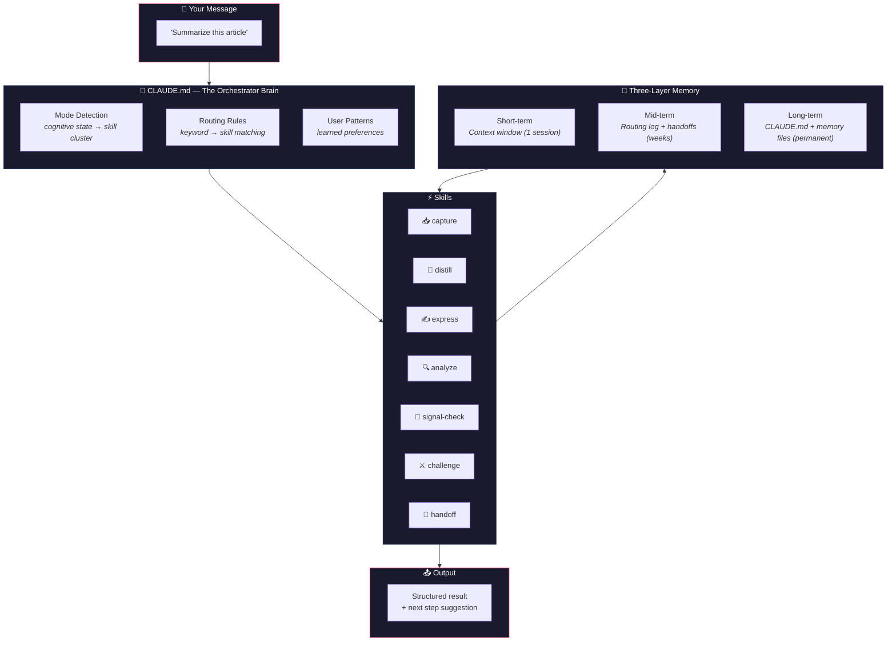

<p align="center">
  <h1 align="center">Claude Orchestrator Starter Kit</h1>
  <p align="center">
    Turn Claude Code into a personal AI assistant — with persistent memory, custom skills, and structured workflows.
  </p>
  <p align="center">
    <a href="LICENSE"></a>
    <a href="https://docs.anthropic.com/en/docs/claude-code"></a>
    
    <a href="https://obsidian.md">
    </a>
  </p>
  <p align="center">
    <a href="https://janrummel.github.io/claude-orchestrator-starter/">🌐 Website</a> ·
    <a href="README.de.md">Deutsch</a> | <strong>English</strong>
  </p>
</p>

---

> **This starter kit is extracted from a real-world personal orchestrator** built for daily use in engineering, research, and knowledge management. What you see here are the **foundational building blocks** — the architecture and patterns that make everything else possible. Obsidian and SQLite are optional add-ons — the kit works standalone with plain markdown files.

---

## The Problem

Every Claude Code session starts from zero. No memory of yesterday's decisions. No idea what you're working on. No reusable workflows. You explain the same things over and over.

**This kit fixes that.**

## What You Get

```
You                                     Claude (with Orchestrator)
─────────────────────────────           ──────────────────────────────────
"Summarize this article"                → Phase: Clarify
                                          Invokes distill skill
                                          Produces structured summary
                                          Next: /express to write output

"Is this analysis solid?"               → Phase: Verify
                                          Invokes signal-check skill
                                          Evaluates across 4 axes
                                          Next: /express to improve

"What could go wrong with this plan?"   → Phase: Verify
                                          Invokes challenge skill
                                          Stress-tests from 3 perspectives
                                          Next: /express to harden

"Save state for next time"              → Invokes handoff skill
                                          Captures decisions + context
                                          Writes project state file
                                          Next session picks up where you left off
```

## How It Works



## The Architecture

### Three-Phase Workflow

Every task follows three phases — don't skip any:

```
  Clarify              Build               Verify
  ─────────────────    ─────────────────    ─────────────────
  What's the problem?  Produce the output   Is it good enough?

  analyze              express              signal-check
  distill              capture              challenge
```

This prevents aimless skill-chaining. Each skill belongs to a phase, and each phase has a clear question to answer before moving on.

### Three-Layer Memory

| | Layer | What | Where | Lifetime |
|---|-------|------|-------|----------|
| **1** | Short-term | Current conversation | Context window | 1 session |
| **2** | Mid-term | Past sessions, routing log | `orchestrator/routing-log.jsonl`, project states | Weeks to months |
| **3** | Long-term | Rules, preferences, knowledge | `CLAUDE.md`, `memory/`, Obsidian | Permanent |

```
┌─────────────────────────────────────────────────────┐
│  ░░░░░░░░ SHORT-TERM  (Context Window) ░░░░░░░░░░  │
│  Current conversation, temporary results             │
│  ⏱ Lifetime: 1 session                              │
├─────────────────────────────────────────────────────┤
│  ▒▒▒▒▒▒▒ MID-TERM  (State + Episodic) ▒▒▒▒▒▒▒▒▒  │
│  Past sessions, routing decisions, handoffs          │
│  ⏱ Lifetime: weeks to months                        │
├─────────────────────────────────────────────────────┤
│  ████████ LONG-TERM  (CLAUDE.md + Knowledge) █████  │
│  Routing rules, preferences, glossary, context       │
│  ⏱ Lifetime: permanent                              │
└─────────────────────────────────────────────────────┘
```

### Seven Core Skills

Each skill is a `SKILL.md` file — **instructions, not code**. They tell Claude how to behave, what tools to use, and what output to produce.

| | Skill | Purpose | You say... |
|---|-------|---------|-----------|
| 📥 | **capture** | Quick note-taking | "Note this", "Save this idea" |
| 🔬 | **distill** | Summarize and condense | "Summarize", "Key takeaways" |
| ✍️ | **express** | Write polished output | "Write", "Draft", "Formulate" |
| 🔍 | **analyze** | Deep analysis with structured thinking | "Analyze", "Investigate" |
| 🎯 | **signal-check** | Quality check / fact check | "Is this solid?", "Quality check" |
| ⚔️ | **challenge** | Adversarial stress-testing | "What could go wrong?", "Stress-test this" |
| 💾 | **handoff** | Save session state for next time | "Save state", "Handoff" |

### Three Key Loops

These 7 skills form three powerful feedback loops:

**Evaluator-Optimizer Loop** — Write, evaluate, improve:


**Evaluator-Challenger Loop** — Write, stress-test, harden:


**Knowledge Cycle** — Capture, process, output, verify:


### Routing

The `CLAUDE.md` file contains routing rules that map keywords to skills. When you say something, Claude checks for matching patterns and invokes the right skill automatically.

```
You: "Summarize this article"
      │
      ▼
CLAUDE.md routing table
      │ matches "summarize" → distill
      ▼
Invokes distill skill
      │
      ▼
Structured summary → suggests: /express to write output
```

### Memory

The `memory/` directory provides long-term storage:

```
memory/
├── glossary.md          — Domain terms and jargon
├── context/
│   └── company.md       — Your work context (role, company, tools)
├── people/              — Key contacts and stakeholders
├── projects/            — Active project documentation
├── decisions/           — Decision log with rationale
└── workflows/           — Proven workflows and best practices
```

## Quick Start

> **Time:** ~5 minutes | **Prerequisites:** [Claude Code](https://docs.anthropic.com/en/docs/claude-code) + a terminal

```bash
# 1. Clone
git clone https://github.com/janrummel/claude-orchestrator-starter.git
cd claude-orchestrator-starter

# 2. Copy to your Claude config
cp CLAUDE.md.example ~/.claude/CLAUDE.md
cp -r orchestrator/ ~/.claude/orchestrator/
cp -r memory/ ~/.claude/memory/
cp -r hooks/ ~/.claude/hooks/

# 3. Start Claude Code — done.
claude
```

Claude will now:
- **Read `CLAUDE.md`** at startup and understand its role
- **Route your requests** to matching skills
- **Remember context** across sessions via memory files

### Optional Add-ons

<details>
<summary>🟣 Obsidian Integration</summary>

Connect your [Obsidian](https://obsidian.md) vault as Claude's knowledge base. Skills like `capture` write to it, `analyze` and `express` read from it.

See [Obsidian Setup](obsidian/README.md) for instructions.
</details>

<details>
<summary>🗃️ Knowledge Database (SQLite)</summary>

For structured data storage (research items, imported datasets, skill usage stats).

See [Knowledge DB Setup](knowledge-db/README.md) for instructions.
</details>

## Developing Your Own Skills

See the [Skill Development Guide](docs/skill-development.md) for a detailed walkthrough.

The short version:

```bash
# 1. Create a skill directory
mkdir -p ~/.claude/orchestrator/skills/my-skill

# 2. Write the SKILL.md
cat > ~/.claude/orchestrator/skills/my-skill/SKILL.md << 'EOF'
---
name: my-skill
description: What this skill does and when to use it.
---

# My Skill

Instructions for Claude on how to execute this skill.

## Workflow
1. Step one
2. Step two
3. Step three
EOF

# 3. Add routing rules to CLAUDE.md
# Add keyword → skill mapping to the routing table
```

## Why Use This?

Most people use Claude Code as a **stateless tool** — powerful, but amnesiac. Every session is a blank slate.

This starter kit turns it into a **stateful assistant** that grows with you:

| | Without Orchestrator | With Orchestrator |
|---|---|---|
| **Memory** | Forgets everything after each session | Remembers decisions, context, preferences |
| **Workflows** | You describe the same steps every time | Skills automate your common patterns |
| **Quality** | Output quality varies unpredictably | Evaluator-Optimizer loop catches issues |
| **Knowledge** | Scattered across tools and notes | Centralized in memory files (+ optional Obsidian/SQLite) |
| **Continuity** | "Where were we?" every morning | Handoff picks up exactly where you left off |

**The core insight:** Claude is already smart. What it lacks is **structure, memory, and habits**. That's what an orchestrator provides — not more intelligence, but better infrastructure around it.

## Growing Beyond the Starter Kit

This kit gives you the **architecture and patterns**. It's intentionally focused — 7 skills, three-phase workflow, basic memory.

From here, you can:
- **Add domain-specific skills** (research, strategy, decision-making)
- **Connect Obsidian** as a long-term knowledge base ([setup guide](obsidian/README.md))
- **Add a SQLite database** for structured data ([setup guide](knowledge-db/README.md))
- **Build workflow chains** that combine multiple skills for complex tasks

The goal isn't to give you everything. It's to show you the **building blocks** — so you can build your own system on top.

## Project Structure

```
claude-orchestrator-starter/
│
├── CLAUDE.md.example          ← The brain: routing rules + memory architecture
│
├── orchestrator/
│   ├── skills/
│   │   ├── capture/           ← 📥 Quick capture
│   │   ├── distill/           ← 🔬 Summarize and condense
│   │   ├── express/           ← ✍️ Write polished output
│   │   ├── analyze/           ← 🔍 Deep structured analysis
│   │   ├── signal-check/      ← 🎯 Quality & substance check
│   │   ├── challenge/         ← ⚔️ Adversarial stress-testing
│   │   └── handoff/           ← 💾 Session state persistence
│   ├── routing-log.jsonl.example
│   ├── user-patterns.md.example
│   └── workflow-templates.md
│
├── memory/                    ← Long-term knowledge base
│   ├── glossary.md.example
│   ├── context/company.md.example
│   ├── people/
│   ├── projects/
│   ├── decisions/
│   └── workflows/
│
├── hooks/                     ← Session lifecycle hooks
├── obsidian/                  ← Obsidian vault integration guide
├── knowledge-db/              ← SQLite knowledge database
└── docs/                      ← Architecture, guides, FAQ
```

## Learn More

| Resource | Description |
|----------|-------------|
| [Getting Started](docs/getting-started.md) | Step-by-step setup guide |
| [Architecture](docs/architecture.md) | Deep dive into the three-layer model |
| [Skill Development](docs/skill-development.md) | Build your own skills |
| [FAQ](docs/faq.md) | Common questions answered |
| [Obsidian Setup](obsidian/README.md) | Connect your Obsidian vault |
| [Knowledge DB](knowledge-db/README.md) | Set up the SQLite database |

## License

[MIT](LICENSE) — use it, fork it, make it yours.

## Contributing

Contributions welcome! See [CONTRIBUTING.md](CONTRIBUTING.md).
